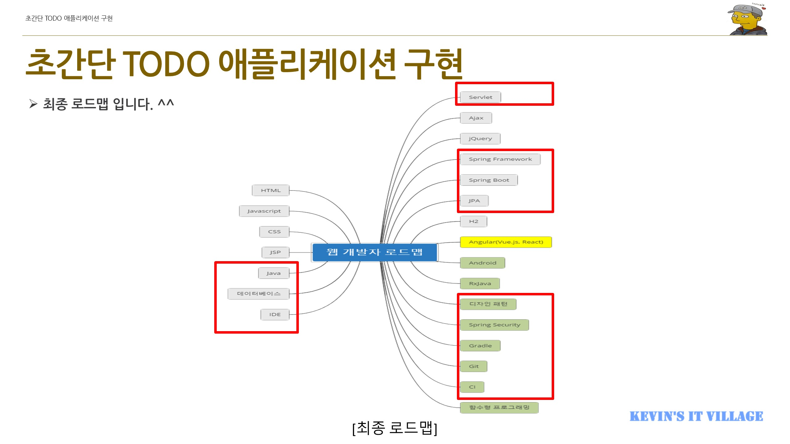

# java-practice
생존을 위한 Java 공부

## 목적
모니터링 프로젝트 진행 및 VOC 전자정부 프레임워크 개발을 위함

## 학습 기간
~~2020/8/28까지~~  
~~2021년 연중~~  
(추후에도 계속 공부해야 함)  
~**영원히**

## 자바 개발 레퍼런스 정리
### [Kevin의 알기 쉬운 Java 개발자 로드맵 이야기](https://www.inflearn.com/course/java-4)
  

## Notion 자료 이관
    Github에 정리하던 자료들을 Notion으로 이관하였습니다
[Notion 바로가기](https://www.notion.so/codybuilder/Java-Backend-0dde28696eb04159837472333a36973d)
