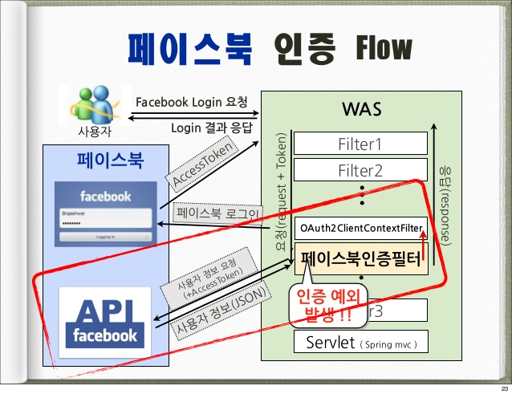

# 스프링 캠프 2013 다시보기
---
## JDK8에 추가된 것들은?
### JDK7 요약
- 숫자표시 방법(_ 사용 가능)
- Switch 조건문에 문자열 추가
- Generic을 쉽게 사용할 수 있는 <>
- 예외처리 다중처리 기능 추가
- NIO2 개선(자바 파일 시스템)

### JDK8 요약
- Lambda Expression
- java.time
- Bulk Operation
### java.time
- ISO8601표준 시간 라이브러리
- 모든 클래스는 immutable/thread-safe
- 안타깝게도 우리나라의 음력은 지원되지 않음
- Clear/Fluent/Immutable/Extensible 원칙 하에 설계
    - Clear : API를 명백하게 설계
    - Fluent : 작성자가 의도한 대로 동작하여 이해하기 쉽게
    - Immutable : 
    - Extensible : 다양한 달력 사용 가능
### Lambda Expression
- 익명 클래스
    - 클래스 내에서 즉석으로 다른 클래스를 정의해서 사용하는 것
- 람다 함수(익명 함수)
    - 함수의 input/output을 즉석에서 정의해서 사용하는 것
    - (inputs) -> output
    - for (input : 리스트)
    - 객체.foreach(함수)
- 장점 : 코드가 매우 심플해진다
- 단점 : 코드 컨벤션을 맞추고 사용해야만 한다

### Bulk Data Operation(java.util.stream.Stream)
- .stream() : 대상 객체를 Stream 객체(원소의 순서를 가진 객체)로 변환해줌
- Stream객체는 map/filter/reduce/foreach등의 lambda식 호환 메소드를 적용할 수 있음

---
## Java Configuration 없인 못 살아!
### Spring 빈 설정 방식의 변화
- 기존은 대부분 XML
- 1.X : XML only
- 2.0.X : XML Schema 설정 지원
- 2.5.X : Annotation 기반 설정 지원
- 3.0.X : Java 코드 기반 설정 지원(@Bean)
- 3.1.X : XML Namespace를 대체할 수 있는 Annotation (@Enable)

- 스프링 부트 : 아예 XML을 손 댈 필요가 없다
### Spring에서 Java Config로 빈을 설정하는 방법
- @Configuration : Bean을 만들어내는 Bean임을 스프링 컨테이너에 알려줌
- @Bean : @Configuration 클래스의 Bean을 리턴하는 메소드에 붙이기
- 주의! 스프링 컨테이너의 Bean 생성 라이프사이클을 정확히 이해하고 작성하지 않으면, DI할때 null 이 들어올 수도 있다.

### 왜 Java Config을 사용하나?
---
## 무식하게 배우는 Gradle!
Gradle의 각 기능들을 직접 따라치며 보여주는 강의
### Gradle의 특징
- 빌드 스크립트 사용가능

### Gradle 프로젝트 생성
- gradle init
- gradle init --type java-libray
- 생성 프로젝트 타입 : basic/pom(Maven to Gradle 마이그레이션)/java-library

### Gradle 환경 설정 (build.gradle)
- ext { javaVersion = "1.7" } 
- sourceCompatibility = javaVersion
- targetCompatibility = javaVersion
- [compileJava,compileTestJava]*.options*.encoding= "UTF-8"

### Gradle Task
- task 테스크명(type: JavaExec ) { args "" main = "메인클래스 패키지경로" }
- gradle 태스크명

### Gradle Test
- src/test/java 아래에 각 java파일에 @Test 테스트코드 작성
- gradle test

### Gradle Wrapper
- 개념 : 그래들 설치가 없이도, 자바만 있으면 jar로 그래들을 사용할 수 있도록 jar로 만들어 둠
- 경로 : gradle/wrapper/gradle-wrapper.jar

---
## ORM 프레임워크를 활용할 때의 설계, 개발 프로세스
### 기존의 개발
ERD 설계 -> 테이블 만들기 -> 모든 로직 다 SQL로 개발 -> 객체는 그냥 데이터 받아서 전달만 해주는 역할
### 1. ERD 설계

---
## Spring Security를 적용한 웹 서비스 구축 사례
### Spring Security 소개
- Spring **인증/권한** 프레임워크
- 구현 : Servlet Filter/Spring AOP 기반
- 유연하고 확장 가능한 특성

### Spring Security 아키텍처
 
- Servlet으로 가기 전에 Security Filter를 한번 거쳐서 전달되는 식으로 동작

### Filter Chain 설정하기
- XML 파일로 설정

### 예시 1. 인증정보 외부화 (DB)
- 스프링 Datasource와 연동 가능
- 쿼리를 직접 XML 코드 내에 작성
- 로그인 요청 처리 순서
    - 사용자 인증 Req(ID/PW)가 Filter Chain에 도달
    - jdbc 인증 필터에 요청이 도달하면 DB접근
    - DB 내 쿼리 조회결과에 따라 Pass/Fail

### 예시 2. 인증방식 다각화 (LDAP/SSO/OAuth 소셜로그인 등)

- 로그인 요청 처리 Flow
    - 사용자의 로그인 요청 Filter Chain에 도달
    - 페이스북 필터에 요청이 도달하면, ID/PW가 없으므로 Exception 발생
    - Facebook 로그인 페이지로 리다이렉트
    - Facebook 로그인 완료시 Access Token Response 발생
    - Access Token이 포함된 채로 다시 Filter Chain 수행
    - 페이스북 필터에 도달하면, Access Token을 포함시켜 Facebook API서버에 Req
    - 정상응답 Res가 도달하면 해당 내용을 서버에 저장 및 로그인
- 페이스북 Access Token 처리 상세 설명
    - Access 토큰을 Facebook Provider에 전달
    - Facebook Provider는 Facebook Service에 사용자 정보 요청
    - Service는 사용자 정보를 API서버에 Req
    - Res를 DTO로 Provider 전달
    - Provider는 인증 필터에 인증정보 전달
- 요청 처리 설정
    - OAuth 설정
    - Facebook Rest Templete 설정
    - Facebook 요청 처리 Service Bean 등록

### 예시 3. URL 권한정보 외부화(DB)

- 특정 URL에 특정 유저만 접근할 수 있도록 하는 것
- FilterSecurityInterceptor 를 추가해 사용
- 권한확인 Flow
    - 유저의 Page Request Filter Chain 접근
    - FilterSecurityInterceptor 도달
    - DB에 접근해 쿼리 실행 및 권한값 획득
    - 권한값에 따라 match

---
## 배운 점
- 기본적인 Spring 구조에 대해서는 이해하고 있어야 발표를 듣고 이해할 수 있다
- 제주도의 사라오름이 그렇게 좋다고 한다
