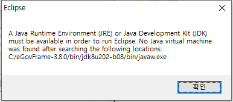
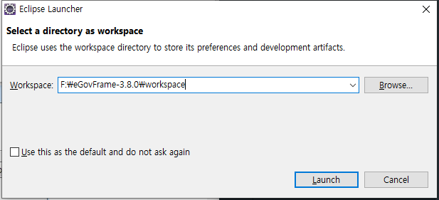
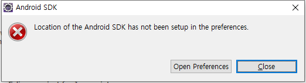
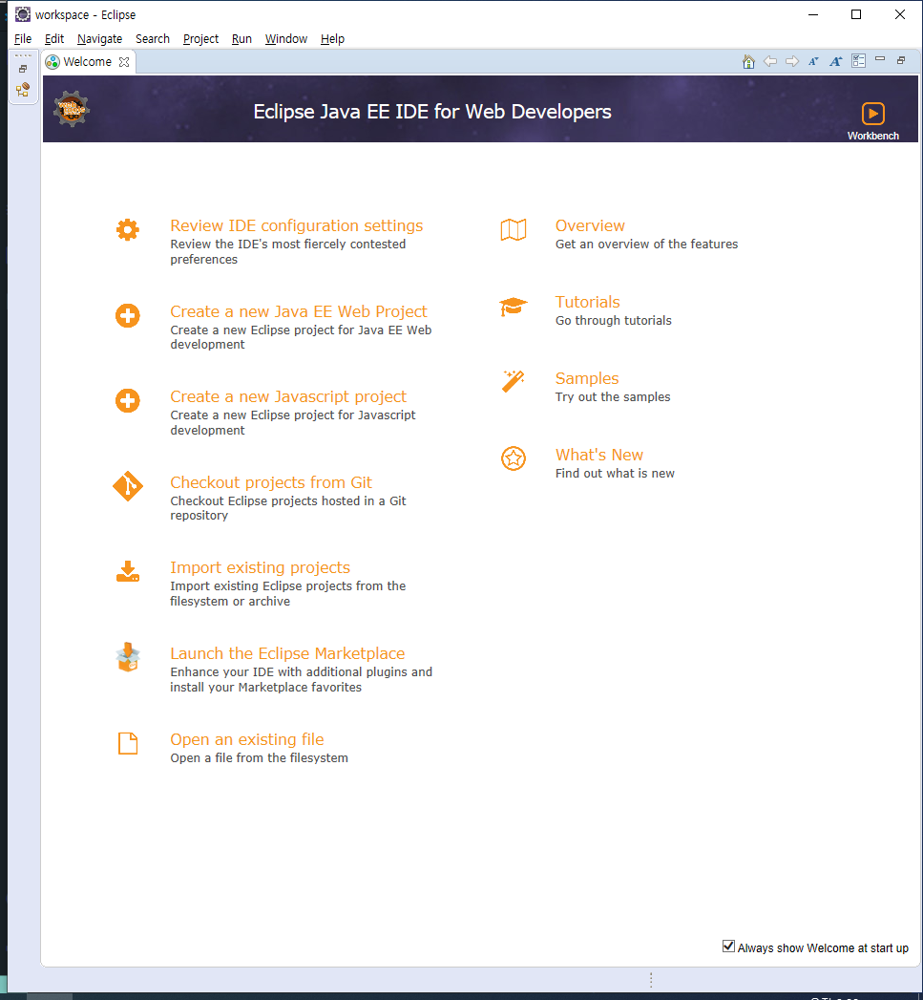
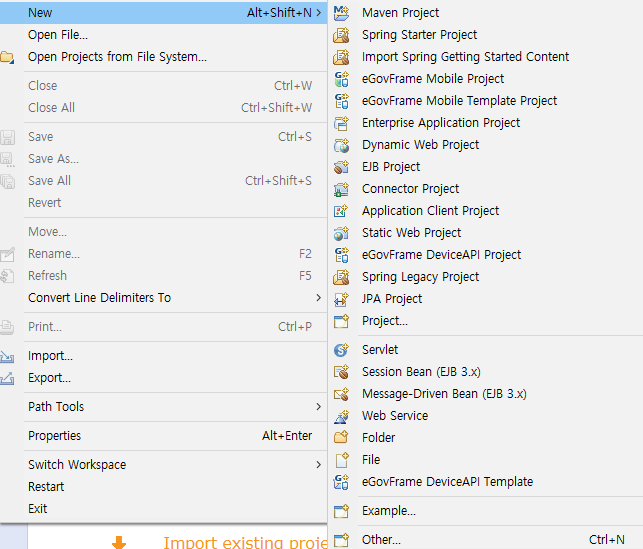
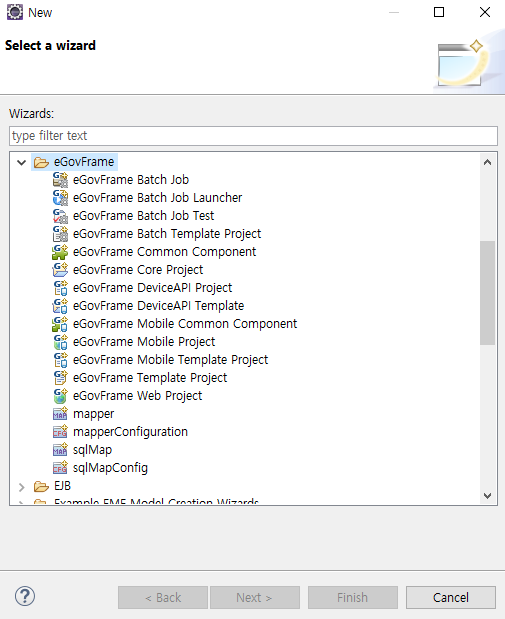

# 전자정부 프레임워크 분투기 - 1. 개발환경 설정
## 전자정부 프레임워크 설치
### 파일 다운로드
전자정부 프레임워크 교육자료를 설치한다.  
다운로드 게시글에 **'경로는 C:\으로 맞춰주시기 바랍니다'**라는 글이 대문짝만하게 붙어 있다. 글을 보는 순간 ***'아... 얘네 파일경로 C:\로 다 하드코딩 해뒀구나...'*** 라는 생각이 뇌리를 스쳤다.  
하지만 사람이 하지 말라면 더 하고 싶은 법, 간단히 무시하고 내 마음대로 F:\에 설치했다.^^ 아마 100% 정상적으로 동작하지 않을 텐데, 설치경로조차 **프레임워크^^**화 해버리겠다는 그 꼰머스러운 마음가짐이 너무나 괘씸해서 반항심으로라도 다른 곳에 깔 수밖에 없었다. 앞으로 쓰여질 대부분의 내용들이 아마 이놈의 절대경로로 인해 발생하는 문제를 해결해 나가는 여정이 될 것이다.  
(그런데, 도대체 왜 절대경로로 해놨을까? 윈도우즈에 상대경로 기능이 없는 것도 아닐텓데? 자바/이클립스에서 상대경로 지원을 안 하나? 만약 그렇다면 더더욱 전자정부 프레임워크를 쓰기 싫어지는데? 그래도 뭐 회사에서 하라니까 해야지...) 
### 바로가기 경로 수정
아니나 다를까, 설치 시작하자마자 바로 안되는 부분이 발견되었다. 설치파일 루트 폴더(F:\eGovFrame-3.X.X) 의 exlipse 바로가기가 실행이 안 된다. 열어보니 아니나 다를까, C:\eGovFrame-3.X.X로 하드코딩 되어 있었다.(...)  
**해결 : System32\cmd.exe를 실행시키고 cmd에서 상대경로로 파일을 실행시켜서 해결했다.**
### JDK 경로 수정
바로가기를 실행시켰지만, 역시나 JDK 경로가 맞지 않아 실행되지 않는다. 에러창을 설펴보니 아니나 다를까, C:\로 하드코딩 되어있다고 아주 당당하게 적혀있다.  
  
대단하다! 전자정부!

**해결 : eclipse.ini파일의 --vm을 상대경로로 수정한다**

### Default Workspace 설정
이클립스를 실행시키면 가장 먼저 default workspace 위치를 물어본다. 아마 기본적으로 각자의 C:\Users\유저명\workspace 으로 설정되어 있을 것이다.  
  
전자정부 폴더 내에 워크스페이스를 만들어 두는 것이 좋다고 하니 일단 그대로 따라한다. (이것도 사실 마음에 안 든다.)

**해결 : 전자정부 설치 폴더 내의 workspace를 선택한다**

### Android SDK 기본경로 설정
모바일 앱개발쪽은 쓸 일은 없는데, Andriod SDK 경로가 없다는 에러메시지가 발생한다.  
  
다행히도 Preference 창에서 설정할 수 있게 해 준다. 전자정부 프레임워크 내에 SDK가 들어있으니(eGovFramework-3.X.X\bin\android-sdk-windows)이를 설정해주면 된다. 아니 경로 세팅 해놓을거면 아예 싹 다 해놓던지, 어떤 건 되어 있고 어떤 건 안 되어 있고... '다 해놓으면 너가 너무 심심해할까봐 설정 몇개는 널 위해 남겨놨어 ㅎㅎ' 이건가?  

**해결 : Preference 창에서 Android SDK 경로(eGovFramework-3.X.X\bin\android-sdk-windows)를 설정해준다**
## 개발 환경 구성
Window > Preference에서 앞으로 공통적으로 쭉 사용될 설정들을 하나하나 지정해 본다.
### Maven Installations 설정
Maven > User Settings에서 eGovFrame-3.X.X\maven\settings.xml 으로 모두 바꾼다.
### Apache Tomcat 설정
Server > Runtime Environment에서 Add > Apache Tomcat 8.0을 선택한 후, 경로를 마찬가지로 eGovFrame-3.X.X\bin\apache-tomcat-8.X.X로 바꾼다.(이때 안해도, 나중에 Run As > Run on Server를 누르면 설정하도록 창이 뜬다)

## 프로젝트 셋업
### 프로젝트 생성
메뉴얼에는 eclipse에서 eGovFrame > STart > New Web Project를 선택하라고 한다. 근데 대체 eGovFrame이 어딨는데?  

eGovFramework 보신 분?  

어쩔 수 없이 설명에는 전혀 언급되어 있지 않은 File > New 를 눌러 보았다. 그런데 여기서 나오는 메뉴에도 eGov Web Project가 없다.  

집나간 eGovFrame Web Project 보신 분?  

찾다 찾다 File > New > Other에서 겨우겨우 eGov Web Project를 찾을 수 있었다. 이거 교육자료 진짜 해보고 쓰는 거 맞아?  
 

**해결 : File > New > Other > eGovFramework > eGovFramework Web Project 선택**

### 빌드툴 설치
프로젝트 우클릭 > Run As > Maven install  
### 프로젝트 실행
프로젝트 우 클릭 > Run As > Run on Server > Manually Define Server 선택 후 Next > eGovFramwork-3.X.X\bin\apache-tomcat-8.X.X 선택 > Finish

## 그 외 eGovFramework에서 제공하는 잡다한 기능들
- UML
- ERD
- DBIO(iBatis/MyBatis 지원)
- Code Generator(스켈레톤 코드 생성)/Project 마법사
- Batch Job