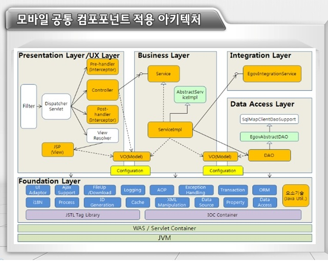

# 전자정부 프레임워크 분투기 - 1. 실행환경(공통) 이해
## 전자정부 프레임워크의 실행환경(Runtime)
### 내용
드디어 좀 핵심적인 부분에 대한 설명이 나온다. 전자정부 프레임워크의 실행환경(=런타임)의 내부 구조에 대해서 설명해주는 부분이다.  
  
가장 윗단의 응용 SW의 비즈니스 로직은 개발자가 설계/구현하고, 런타임 내의 Presentation/Business/Integration/Data Access Layer에서 SW가 실행되며 비즈니스 로직이 돌아간다. 이 Layer들의 동작은 공통 Layer인 Foundation Layer에 의해 구현된다.  

생각했던 것 보다 아주 깔끔하고 괜찮은, 정석적인 구조를 가지고 있다. 확실히 '표준화' 의 입장에서는 정부가 만든 것 치고는 아주 잘 구현되었다고 볼 수 있겠다.  

### 전자정부 런타임의 레이어 목록
1. 화면처리
- UI레이어
- MVC/Ajax/UI Adaptor(화면단과 업무단 데이터 인터페이스)/Validation/Internationalization
2. 업무 처리
- 업무 흐름 제어, 에러 처리 등
- Process Control/Exception Hadnling
3. 데이터 처리
- DB 연결, 트랜젝션 등 처리
- Data Access(iBatis,MyBatis,Spring JPA)/Data Source/ORM(**Hibernate**)/Transcation
4. 연계통합
- 타 시스템과 연동 기능
5. 공통기반
- 런타임에서 공통적으로 사용되는 기능들
- AOP/IoC/Cache/Security(**Spring Security**)/ID Generation/Compress-Decompress/Encryption-Decryption/Excel/File Handling/File Upload-Download/FTP 등등
6. 배치처리
- 대용량 데이터 처리 지원(**Spring batch**)
- Batch Core/Batch Execution/Batch Support
7. 모바일 화면처리
- 모바일 화면 구성
8. 모바일 디바이스 API
- 모바일 앱 개발용 디바이스 API

## 공통기반 레이어(Fundation Layer)
### 스프링 프레임워크

### IoC
### AOP

