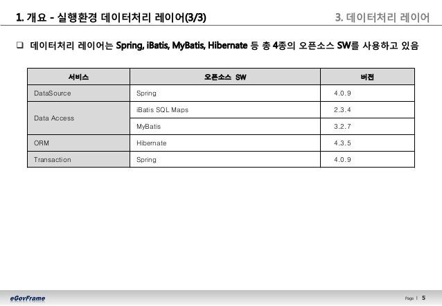
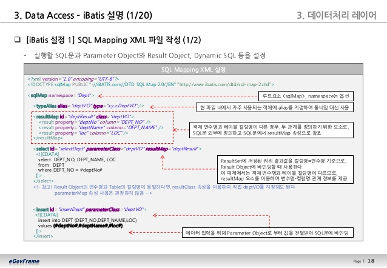
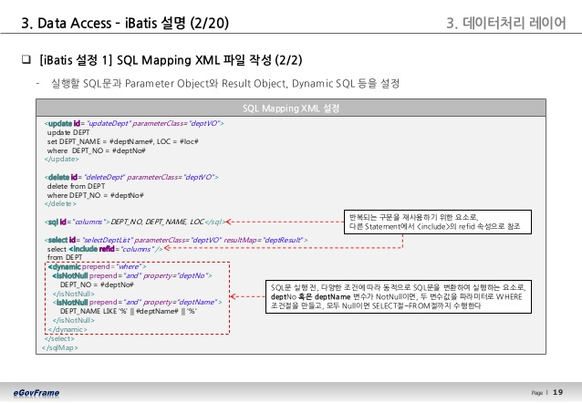
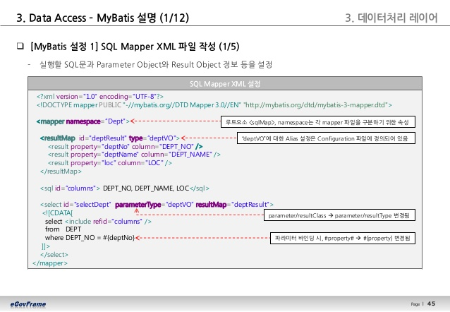
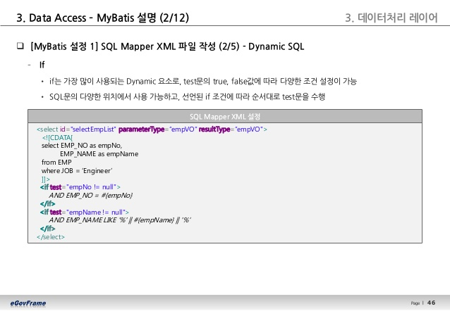
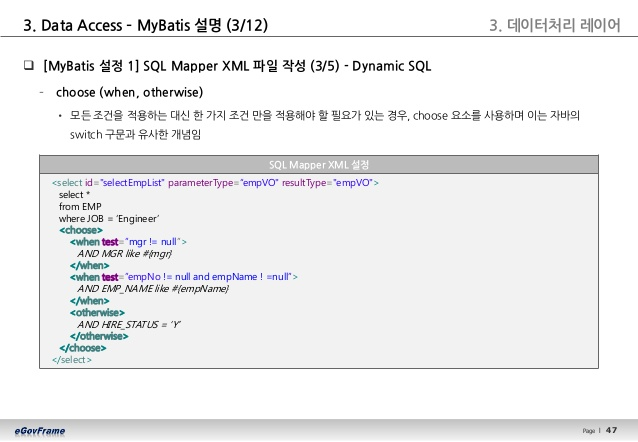
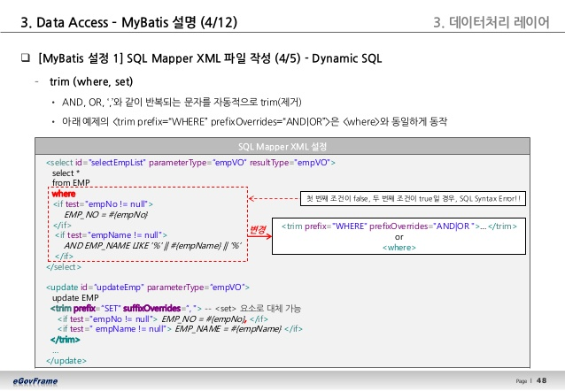
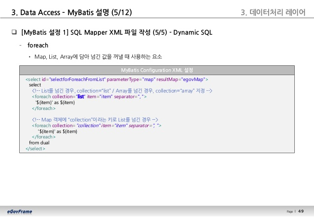
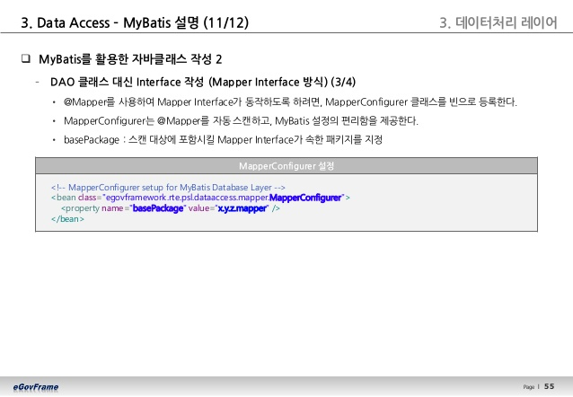

# 전자정부 프레임워크 분투기 - 2. 실행환경(데이터처리) 이해
## 데이터 레이어
데이터베이스와 연결, 영속성, 트랜잭션 등을 다루는 레이어이다. 데이터 관련은 전부 이쪽 레이어에서 처리함으로서, 업무로직에서 데이터 처리 관련 관심사를 분리하고 종속성을 낮춘다.  
데이터 처리 레이어는 4종류의 오픈소스로 이루어져 있다.  
  
~~다 아는 사람들이구만~~ 의외로 Hibernate에 대한 지원까지 포함하고 있어서, 나름 괜찮다고 생각했다. 하지만, 역시나 관계형 데이터베이스에 국한되어 벗어나지 못하고 있는 점은 말할 것도 없었다. 함수형 프로그래밍/문서형 데이터베이스 개념이 생겨난지 한세월이고 이제는 빅데이터 파이프라인이 생기네 마네 하는 마당에(물론 나는 관계형 데이터베이스도 아주 좋아하지만) 아직까지 관계형 DB에 목매달고 있는 건 좀...
### DataSource 서비스
데이터베이스 연결을 제공하는 객체. 사실상 드라이버다. 아래와 같은 방식으로 구성된다. 
1. DataSource 객체를 Bean에 선언한다.
2. DataSource 객체의 getConnection() 메소드를 이용해 연결을 획득한다.  
아쉽게도 교재의 내용은 그냥 각 드라이버들을 등록하는 방법/테스트하는 코드 뿐이었다. 각 드라이버의 특징에 대해서는 혼자 찾아봐야 하는 부분이다.

### DataAccess 서비스:iBatis
SQL이 정의된 XML + SQL로부터 생성된 객체 DAO = SQL Mapper  
소스코드와 SQL문을 분리하여 유지보수가 쉽도록 해 주고, 동적인 SQL문까지 사용할 수 있도록 한다.
아래와 같은 순서대로 사용할 수 있다.  
1. SQL XML을 작성한다.  
SQL XML의 형식은 아래와 같다. 
  
  

2. iBatis Config XML을 작성한다  
Config XML의 형식은 아래와 같다. 근데 아마 신규 구축할 때가 아닌 이상 유지보수시에는 건드릴 일은 거의 없을 것이니, 간단하게만 보고 넘어가면 될 듯 하다.  
  

3. SqlMapClientFactoryBean을 선언한다.  
Spring Container가 SqlMapClient를 생성하고 관리할 수 있도록 Factory를 선언해 준다고 한다.  해당 팩토리 빈에서 생성된 SqlMapCLient에서 iBatis 관련 메소드를 실행할 수 있다. 

4. EgovAbstractDAO 클래스를 상속받아 원하는 DAO 클래스를 작성한다.  
DAO는 앞에서 생성한 SQL XML을 실행시키고 결과를 VO에 전달한다.

iBatis는 실질적으로 업무에서 사용되지 않을 것 같아서, 전체적인 구조만 파악하고 MyBatis로 넘어간다.

### DataAccess 서비스:MyBatis
iBatis와는 약간의 구현에서 차이가 있는데, 상세한 성능적인 비교는 나와 있지 않고 찾기도 쉽지 않다.  
아래의 순서대로 사용할 수 있다. iBatis와 용어 차이를 제외하고 흐름은 거의 동일하다.  
1. SQL Mapper XML 작성
SQL XML의 형식은 아래와 같다. 화면단 XML을 보면 아마 아래와 같은 형식으로 구현이 되어 있을 것이다.  
정적 SQL의 경우 :  
  

동적 SQL의 경우 : 
- if/choose조건문 등을 이용해 WHERE절에 조건을 추가하거나
- trim 으로 AND/OR처럼 반복되는 구문을 제거해주거나
- foreach 등의 구문을 쓸 수 있다.  
  
  
  
  

2. MyBatis Config XML 작성  
마찬가지로 크게 중요하지 않을 듯 해서, 간단히 보고 넘어간다.

3. SqlSessionFactoryBean 선언  
Spring Container가 SqlSession를 생성하고 관리할 수 있도록 Factory를 선언해 준다고 한다.  해당 팩토리 빈에서 생성된 SqlSession에서 MyBatis 관련 메소드를 실행할 수 있다. 

4. EgovAbstractMapper를 상속받아 DAO 클래스 선언  
iBatis와 완전히 동일하다.  

5. Mapper Annotation을 이용해 Mapper interface 선언 (+MapperConfigurer Bean 등록)
MyBatis에서 명백히 개선된 부분으로, Mapper Interface를 선언하고 위에 @Mapper 어노테이션만 달아주면, 함수명만 적어도 알아서 SQL문을 수행시켜 준다.  
다만, 이를 위해서는 MapperCongifurer Bean을 등록해 주어야 한다. 등록 양식은 아래와 같다.  
  

(편법 : 아래와 같이 Mapper Interface에 @Select 등의 어노테이션을 통해 바로 SQL을 집어넣을 수 있지만, 관심사의 분리 및 쿼리 유연성 감소라는 측면에서 추천하지 않는다고 한다.)  
 

### Transaction 서비스
아마 내 뇌피셜이지만, 트랜잭션을 건드릴 일은 업무중에는 없지 않을까? 일단 넘어가고, 나중에 보는 것이 낫겠다.