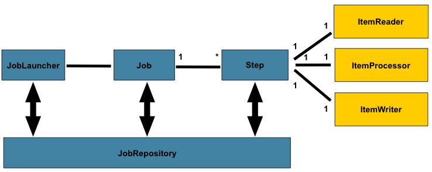
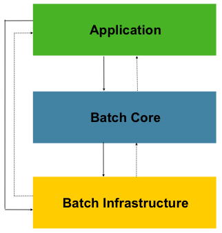
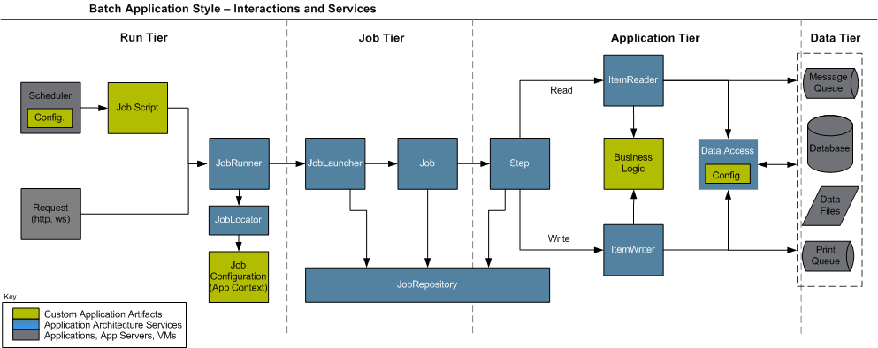

# 전자정부 프레임워크 분투기 - 3. 실행환경(배치) 이해
## 배치 레이어
대용량 데이터 처리를 위한 환경을 제공하는 레이어. 웹서비스와 연계해서 돌아갈 수도 있을 것 같은데, 내가 지금까지 본 배치는 약간 웹서비스와는 독립적으로 돌아가는 크론탭 느낌이긴 했다.  

### 들어가기 전에 : 배치의 정의
    Batch processing is execution of a series of programs ("jobs") on a computer without human interaction

배치 프로세싱이란, 사람의 상호작용 없이 컴퓨터에서 수행되는 일련의 작업들이다. (특정 시간에, 자동으로, 백그라운드에서 돌아가는 작업)  

    Spring Batch is lightweight, comprehensive batch framework designed to enable the development of robust batch applications viatal for the daily operations of enterprise systems

스프링 배치란, 기업 시스템에서 핵심적인 강건한 배치 어플리케이션을 수행 할 수 있게 만들어진 경량화되고 포괄적인 배치 프레임워크이다.

### Spring Batch의 구성 아키텍처
  
매우 직관적인 구성 및 동작 구조를 가지고 있다.
1. Job Repository에서 Job들에 대한 모든 Metadata 를 보유하고 있다.
2. 실행조건이 만족되면, Job Launcher가 Parameter를 받아 Job을 수행시킨다.
3. Job은 내부에 정의된 Step에 따라 실행된다.
4. Step은, ItemReader에서 읽어들여 Item Processor에서 처리한 후 Item ItemWriter에서 저장한다.

### Spring Batch 코드 아키텍처
  
1. Application : 개발자가 작성한 Batch Job 코드
2. Batch Core : 배치 실행에 필요한 설정 및 구현체
3. Batch Infrastructure : App/Core에서 사용하는 I/O등 기본적인 기능
매우 깔끔한 구조를 지니고 있다. 역시 프레임워크도 믿고쓰는 해외산이다.

### Spring Batch Flow
외부 프로그램/데이터소스 등을 모두 포함한 전체적인 Batch의 실행흐름이다.  
  
위 사진 중 초록색 박스가 개발자가 구현해주는 설정/로직 부분이다

## Batch 세부 구성요소
### Job Repository
개념 : 모든 Job에 대한 Metadata를 담는 저장소  
설정 : XML상에 <job-reposity> 태그에 설정
구현 : <bean>으로 등록하여 사용

### Job Repository
개념 : Job을 실제 수행시키는 역할  
구현 : <bean>으로 등록하여 사용. 기본적으로 SimpleJobLauncher 사용.  
설정시 JobExecutor를 동기식/비동기식으로 설정 가능

### Job Runner
개념 : 외부 요소(스케쥴러, Web Request 등)와 연동하여 Job Launcher를 수행해주는 모듈  
실행방법 : 
1. CMD : CMD 명령어를 통해 java application 처럼 실행
2. Web : Web Request에 대해 jobLauncher 객체의 run() 메소드를 통해 실행  
스케쥴러 : 기본적으로 Quartz 사용. <bean>으로 등록하여 스케쥴러 사용

### Job
개념 : 실제 작업
설정 : XML 파일 내에 <job> 태그로 설정. <step> 태그로 스텝 연결

## Batch Process

### Lab 302 - 배치 템플릿 프로젝트 생성
목표 : 배치 템플릿을 가지는 프로젝트를 만들어 본다
1. Batch Template Project를 생성한다.
2. BatchSchedulerJobRunner java파일을 단독으로 실행시켜 본다
3. 특정 배치에 대해 Test를 만들어 본다.
4. 특정 배치를 web에서 수행시켜 본다

해결 :
1. eGov > New > Batch Template Project 클릭하면 된다
2. 그냥 해당 파일 우클릭 후 Run As > Java Application하면 된다. 그러나 이게 어떤 의미인지 파악하지 못한 것이 아쉽다.
3. eGov > Test > Batch Test해서 원하는 배치 선택 후 테스흐하면 된다. 마찬가지로 테스트가 어떤 의미인지 파악하지 못한 것이 아쉽다.
