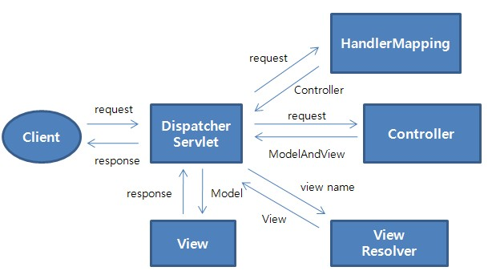

# 전자정부 프레임워크 분투기 - 4. 실행환경(화면처리) 이해
## 화면처리 레이어
말 그대로 화면처리를 해주는 레이어, 전자정부 프레임워크는 내부적으로 서버사이드 렌더링이 가능하도록 구성해서 사용하고 있는 듯 하다.

## MVC:Spring MVC
### Spring MVC의 장점
Spring MVC에 여러가지 장점이 있지만, 가장 두드러진 장점이자 가장 구분디는 Spring만의 특징이라고 하면 @Annotation인 것 같다.  
사실 이 어노테이션이 처음 볼 때는 도대체 이게 무슨 소린지, 이걸 왜 쓰는지 모르지만, 어노테이션 없이 스프링에서 제공하는 것과 똑같은 클래스를 직접 만들어서 쓰려고 하면 그야말로 대환장파티가 열리게 되는 듯 하다.  

### 스프링 MVC 동작 흐름

### MVC - DispatcherServlet

### MVC - @MVC
경로 : src\main\webapp\WEB-INF\config\springmvc\context-servlet.xml  
@ 어노테이션을 등록하는 방법에 대해 설명하는 페이지 같다. 정확히 이해는 안 되지만, 주요한 어노테이션에 대한 설명은 확실히 해 두고 가면 좋다.

1. @Controller
해당 클래스가 컨트롤러임을 알려주기 위한 어노테이션

2. @RequestMapping
요청된 URL과 클래스/메소드를 연결해주기 위한 어노테이션  
문법 : @RequestMapping(value,method,params)  
인자 : 
|이름|데이터타입|설명|예시|
|--|--|--|--|
|value|String[]|URL값||
|method|RequestMethod[]|HTTP 메소드||
|params|String[]|HTTP param querystring||

3. @RequestParam
Request의 Parameter로 온 값을, 메소드의 인자와 연결시켜 주기 위한 어노테이션

4. @ModelAttribute
Controller의 메소드에서 View에게 Model을 넘겨줄 수 있다. 이떄 메소드의 반환값을 Model의 속성 중 하나로 설정해 념겨주기 위해 사용하는 어노테이션이다.  
이때 딱히 특정 View를 타게팅해서 주는 것이 아니라, 모든 View에 다 Model을 전달하는 것 같다. View에서는 그냥 자신이 쓸 속성을 골라서 {} 안에 담아서 쓰면 되는 것 같다.

5. @SessionAttribute

6.
### LAB301 - mvc 실습(1)
목적 : MVC의 기본 동작을 이해한다  
1. Controller와 메소드를 만들어 본다.
2. View 파일(jsp)을 만들어 본다.
3. 해당 Controller와 View를 연결해 본다.

해결 :
1. src\main\java아래에 각 기능별로 패키지가 선언되어 있다.  
우리는 Helloworld이므로, HelloWorldController를 찾는다.
2. 컨트롤러 내부에, viewname을 반환하는 메소드를 만든다.  
즉 컨트롤러 메소드들은 특정 기능을 수행하는 것이 아니라, 단순히 View의 이름을 연결해주는 역할만을 한다.
3. 해당 메소드에 @RequestMapping 어노테이션을 넣어 URL을 연결해 준다.
4. 컨트롤러의 viewname과 일치하는 경로에 jsp를 만들어 준다.  
jsp는 src/main/webapp/WEB-INF\jsp에 보통 들어있다.

### LAB301 - mvc 실습(2)
목적 : 로그인 기능을 구현한다  
0. Bean을 설정해 본다
1. 로그인 Controller를 작성한다
2. 로그인 Java파일을 작성한다.

해결 :  
0. src\main\webapp\WEB-INF\config\springmvc\context-servlet.xml 경로 내에 있는 messageSource Bean의 주석을 풀어준다.  
이렇게 하지 않으면, 나중에 페이지에서 에러가 발생한다.
## Internationalization : LocaleResolver
국제화라고 쓰여있어서 거창한 것인 줄 알았는데, 그냥 웹페이지에서 '한국어' 를 쓰기 위해 설정하는 것 같다.  
즉, 사용자의 현재 언어 정보를 받아, 해당하는 언어를 페이지에 띄워주기 위한 것이다. 사용자의 언어 정보는 아래의 3가지로부터 얻는다.
1. CookieLocaleResolver : 쿠키로부터 Locale정보 획득
2. SessionLocaleResolver : 세션으로부터 Locale정보 획득
3. **AcceptHeaderLocaleResolver : 클라이언트 브라우저 정보로부터 Locale 획득(Default)**

LocaleResolver를 사용하기 위해서는, Bean을 등록하는 절차를 수행해주면 된다.

## Ajax : 

## Validation : Jakarta Commons Validator

## UI Adaptor : 
(업무에서 사용할지 안할지 모르겠는데, 추후에 필요하면 공부)