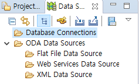
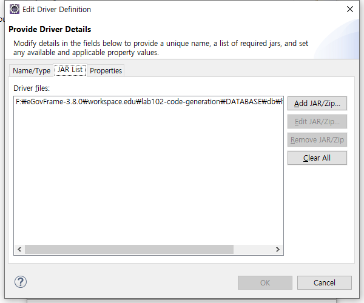
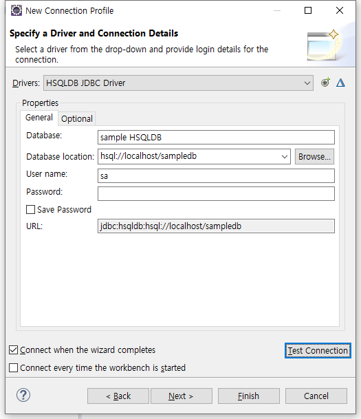

# 전자정부 프레임워크 분투기 - 2. Code Generation 실습
## Code Generation
Code Generation이란 : 
1. 사전 정의된 Template를 불러와서 CRUD 코드를 생성해 준다
2. 클래스 다이어그램에 정의한 Model로부터 코드를 생성해 준다.

### 데이터베이스 기동
실습용으로 작성된 데이터베이스를 실행시키기 위해, workspace.edu\lab102\DATABASE\db에 들어가서 runHsqlDB.cmd를 실행시켰다. 역시나 이번에도 실망시키지 않는 경로 에러 메시지가 떠 있다.  

**해결:앞에서 eclipse 바로가기 때와 동일하게 runHsqlDB.cmd 파일을 편집해 경로를 바꿔서 해결했다.**
### 데이터베이스 연결
'Data Source Explorer'에 들어갔는데, Database Connections가 없다. 분명히 자동으로 만들어진 것 처럼 이야기했는데, 전혀 없다. 역시 또 내가 커넥션을  불러와 줘야 한다...  
  

커넥션을 만들기 위해 db 폴더 구조를 살펴보니, runHsqldb.cmd등이 이미 존재하고, HSQLDB관한 파일들이 이미 저장되어 있는 것으로 보아, 이미 HSQL DB 서버가 생성되어 있고 그 안에 테이블들이 저장되어 있는 것으로 보인다. 따라서 
1. hsqldb driver를 찾아서 선택한 후
2. driver를 이용해 connection 을 만들되
3. connection 의 목적지 경로를 이미 돌아가고 있는 HSQL DB 서버로 지정하면 기존의 서버 데이터를 그대로 쓸 수 있다.

Database Connections > 우클릭 > New를 선택해 창을 띄워 주고, HSQLDB를 선택한다. Drivers를 선택하는 창이 나오는데, jar list 탭을 선택해 workspace.edu\lab102\DATABASE\db 폴더에서 제공되는 hsqld 드라이버 jar 경로를 찍어준다.  
  

다음은 데이터베이스 경로를 지정해 줘야 한다. 기존 서버의 주소는 hsql://localhost/sampledb이다. (어떻게 알았냐고? hsqlmanager.cmd 안에 적혀있다.)  
  

**해결 : 직접 New Connection을 만들고 드라이버와 DB서버 경로를 선택해 준다**

### 템플릿 뷰 열기
Window > Show View > Other > eGovFrame > eGovFrame Templates를 선택한다. 화면 하단에 탬플릿 뷰가 생긴다. 여기서 원하는 탬플릿을 만들어낼 수 있나 보다

### CRUD 코드 generation
실행이 안되는데, 뭔지 알 수가 없어서 생략